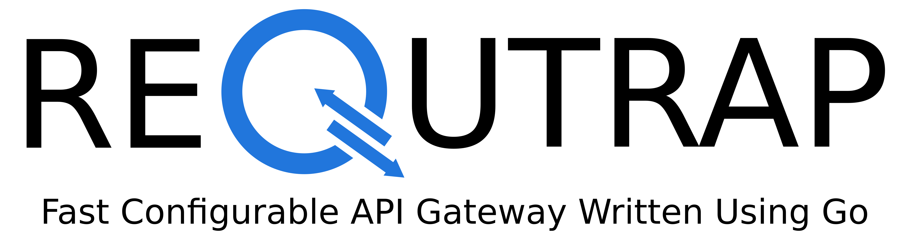
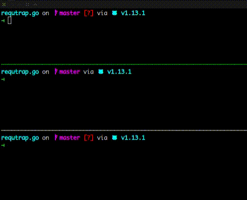

[](https://goreportcard.com/report/github.com/libidev/requtrap.go)


API Gateway is service that handle all request from client and forward to any services.
More detail about API Gateway, you can see [here](https://www.nginx.com/learn/api-gateway/).

RequTrap will help you in implementing API Gateway. It is simple and fast, you can use it easily, sure.



# Configuration
You can configure RequTrap by creating a YAML file which 
contain configuration schema. It will look like example below.

```yml
name: book-store
host: 127.0.0.1
port: 8080
services:
  - path: /books
    upstream: http://127.0.0.1:8001
  - path: /authors
    upstream: http://127.0.0.1:8002
```

If you want to configure CORS, just put example bellow
at bottom of YAML configuration file.

```yml
...
cors:
  enable: true
  methods:
    - GET
    - POST
    - PUT
    - DELETE
  origins:
    - http://localhost:3000
```

# CLI Commands
### Starting API Gateway
`requtrap start [path/to/configuration.yml]`

### Stoping API Gateway
`requtrap stop [gateway-name]`

### More
`requtrap help [command]`

# Contribution
Please make sure to read the [Contributing Guide](./CONTRIBUTING.md) before making a pull request.

## License
[MIT](./LICENSE)
